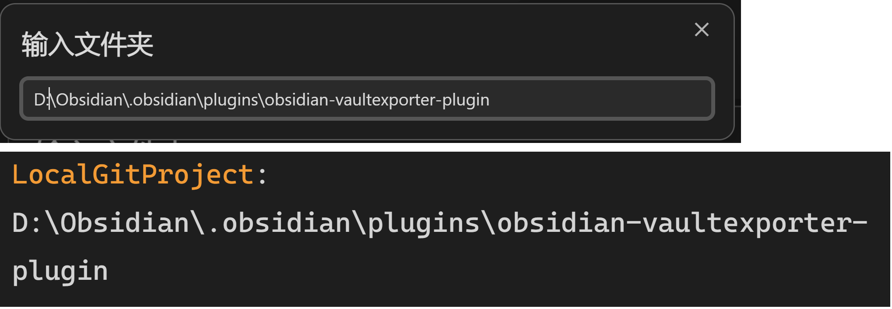
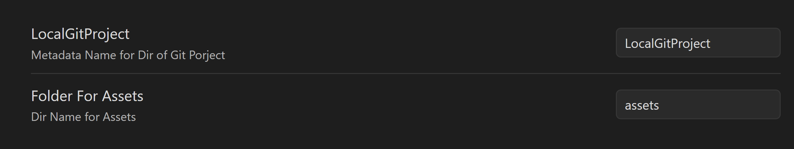

需要先安装 [[obsidian-notechain-plugin]] 和 [[Templater]] 插件。

`Vault Exporter: Set Git Project`：将当前笔记绑定项目笔记。输入目录，生成 `LocalGitProject` 的元数据。

`Vault Exporter: Export readMe`：将当前笔记输出到 readme，笔记引用的图和文件复制到 `LocalGitProject/assets` 下。复制 readme 时，会更换链接。

元数据和附录可以在设置页面更改。

