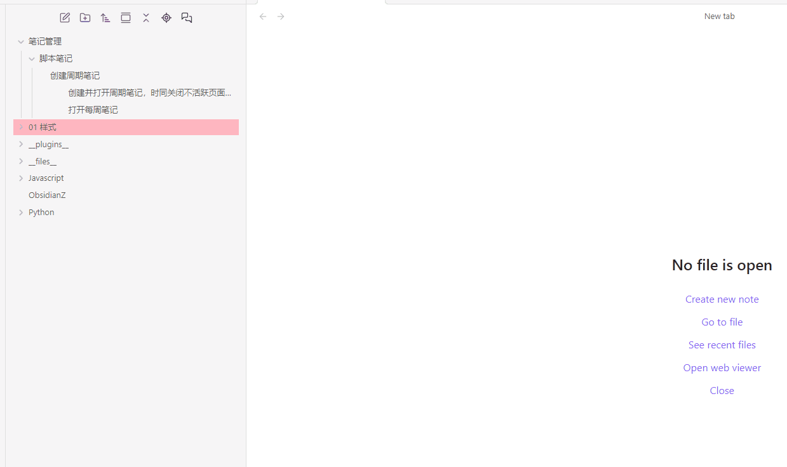

## NoteSync：多库笔记，一键镜像

同步笔记 / 插件、导出 README、下载示例库，把笔记复制为公众号 / Word 排版，以及通过 API 上传到飞书知识库。  
Sync notes and plugins, export README, download example vault files, copy notes as WeChat Official Account or Word HTML, and upload notes to Feishu Wiki via API.

> Desktop only（仅桌面端）。部分导出功能依赖 NoteChain / EasyAPI。

---

### 导出笔记/Export Notes

同步文件或文件夹：  
To sync a file or folder:

1. 在文件列表中，右键点击文件或文件夹；  
    Right-click the file or folder in the file list;
    
2. 点击 `同步到其它库` / `Sync to other vault`；  
    Click `Sync to other vault`;
    
3. 选择预设目标库，或输入目标库根目录；  
    Pick a preset vault, or enter the root directory of the target vault;
    
4. 笔记、文件夹以及笔记嵌入的附件，会按相同的文件结构复制到目标库。如果目标库中存在同名文件，则根据更新时间判定是否覆盖；  
    Notes, folders, and embedded attachments will be copied to the target vault with the same structure. If a file with the same name exists, it will be overwritten only if the source is newer.

### 导出插件/Export Plugins

1. 执行命令 `Note Sync: 导出插件` / `Export plugin`；  
    Run the command `Note Sync: Export plugin`;
    
2. 选择要导出的插件；  
    Select the plugin you want to export;
    
3. 选择是否导出 `data.json`；  
    Choose whether to export `data.json`;
    
4. 选择或输入插件保存目录（会自动定位到目标库的 `plugins` 目录）；  
    Select or enter the directory where the plugin will be saved (prefers the target vault's `plugins` folder);
    
5. 输入回车键确认；  
    Press Enter to confirm.


### 将笔记导出为 readMe / Export a Note as `readMe`

执行 `Note Sync: 设置导出笔记选项` / `Set config to export note`，设置导出信息：  
Run `Note Sync: Set config to export note` to configure the export settings:

- `Dir`：导出路径  
    `Dir`: Export directory
- `Name`：文件名称，默认为 readMe  
    `Name`: File name (default: readMe)
- `Assets`：附件存放路径  
    `Assets`: Path to save attachments
- `RemoveMeta`：是否移除元数据，默认为 true  
    `RemoveMeta`: Whether to remove metadata (default: true)
- `UseGitLink`：附件链接使用 Git 格式，默认 true  
    `UseGitLink`: Use Git-style links for attachments (default: true)

> [!NOTE]+ 文件导出配置示例  
> [!NOTE]+ Example Export Configuration
> 
> ```yaml
> note-sync:
>   Dir: D:\github\ObsidianZ-dev\.obsidian\plugins\note-sync
>   Name: readMe_中文
>   Assets: ./assets
>   RemoveMeta: true
>   UseGitLink: true
> ```

然后执行 `Note Sync: 导出当前笔记` / `Export current note` 导出当前笔记。  
Then run `Note Sync: Export current note` to export the current note.

---

### 导出微信公众号 / Export WeChat Official Account

把当前笔记（或选中内容）转成公众号可用的 HTML，并写入剪切板。  
Convert the current note (or selection) into WeChat-ready HTML and copy it to the clipboard.

1. 打开笔记，按 `Alt+Shift+P`（命令：`导出微信公众号` / `Export wxmp`）；  
    Open a note and press `Alt+Shift+P` (`Export wxmp`);
2. 未选中文本 → 导出整篇；选中文本 → 只导出选区；  
    No selection → whole note; selection → selection only;
3. 打开网页版公众号编辑器，粘贴即可。  
    Paste into the web WeChat editor.

本地图片会转成 base64；可在设置里配置标题 / 行内代码样式，并支持 `cards-album` 并排图与自定义 `section@` 规则。  
Local images become base64. Configure heading/inline-code styles in Settings; supports `cards-album` side-by-side images and custom `section@` rules.

详细步骤见仓库内笔记 `NoteSync 公众号排版教程`。  
See the in-vault note `NoteSync 公众号排版教程` for the full guide.

### 复制为 Word / Copy as Word

把当前笔记（或选中内容）转成 Word / WPS 友好的 HTML，并写入剪切板。  
Convert the current note (or selection) into Office/WPS-friendly HTML and copy it to the clipboard.

1. 打开笔记，按 `Alt+Shift+W`（命令：`复制为 Word 格式` / `Copy as Word`）；  
    Open a note and press `Alt+Shift+W` (`Copy as Word`);
2. 未选中文本 → 导出整篇；选中文本 → 只导出选区；  
    No selection → whole note; selection → selection only;
3. 粘贴到 Word 或 WPS。标题会映射为「标题 N」、正文映射为「正文」，避免变成「普通（网站）」。  
    Paste into Word or WPS. Headings map to built-in Heading styles and body text to 正文, avoiding the “Normal (Web)” style.

### 导出多条笔记 / Export Notes

将多篇笔记合并导出为一个 Markdown 文件。  
Merge multiple notes into one Markdown file.

1. 执行命令 `导出多条笔记` / `Export notes`；  
    Run `Export notes`;
2. 若当前选中文件较少，可选择范围：`All`（含子文件夹）/ `Brother`（同级）/ `Subfolder`（仅子文件夹）；  
    With few selected files, choose scope: `All` / `Brother` / `Subfolder`;
3. 在另存为对话框中选择保存路径。  
    Pick the save path in the Save dialog.

合并结果按文件名分段，形如：  
Each note is wrapped with a name banner, for example:

```md
=====
笔记A.md
=====

...内容...
```

若安装了 NoteChain，会按笔记链顺序排序。  
With NoteChain installed, notes are sorted by the note chain.

### 上传到飞书知识库 / Upload to Feishu Wiki

通过飞书开放平台 API 把笔记写成知识库文档，不经过复制粘贴。  
Upload notes into Feishu Wiki as native documents via Open API (no clipboard).

1. 在[飞书开放平台](https://open.feishu.cn)创建企业自建应用，填写 App ID / App Secret；  
    Create a custom app on the [Feishu Open Platform](https://open.feishu.cn) and fill in App ID / App Secret;
2. 开通权限：`wiki:wiki`、`docx:document`、`docx:document.block:convert`、`drive:drive`，发布应用；在目标知识库文档上「添加文档应用」，把该页链接填进父节点；  
    Enable `wiki:wiki`, `docx:document`, `docx:document.block:convert`, `drive:drive`; publish the app; add the app on a Wiki page and paste that page URL as the parent node;
3. 在设置里「测试连接」，再「选择知识库位置」（或粘贴 wiki 链接）；  
    Use **Test connection**, then **Pick Wiki location** (or paste a wiki URL);
4. 命令 `上传当前笔记到飞书知识库`，或右键文件/文件夹 `上传到飞书知识库`。  
    Run `Upload current note to Feishu Wiki`, or right-click a file/folder.

再次上传同一篇笔记会覆盖飞书端内容（映射写在 frontmatter `note-sync.Feishu`）。文件夹会按目录在知识库中创建对应节点。本地图片会一并上传。  
Re-upload overwrites the same Wiki doc (binding is stored in `note-sync.Feishu`). Folders are mirrored as Wiki nodes. Local images are uploaded.

详细步骤见飞书同步教程。  
See the Feishu Wiki sync tutorial for the full guide.

---

### 下载示例库文件/Download Example Vault Files

在 `设置` 页面配置 `Git 仓库`，需要包含分支名称：  
Configure the `Git repository` in the **Settings** page. The URL must include the branch name:

> [https://github.com/zigholding/ObsidianZ/tree/master](https://github.com/zigholding/ObsidianZ/tree/master)  
> [https://gitee.com/zigholding/ObsidianZ/tree/master](https://gitee.com/zigholding/ObsidianZ/tree/master)

执行 `下载 Git 仓库文件` / `Download git repo` 命令，依次选择仓库、文件夹和文件进行下载。输入 `all` 可下载所有文件（不包括子文件夹）。  
Run `Download git repo`, select the repository, then choose folders and files to download. Enter `all` to download all top-level files (excluding subfolders).

  

下载文件时，也可以预设路径，快速下载：
You can also preset the path for quick download when fetching files:

> [https://github.com/zigholding/ObsidianZ/tree/master/.obsidian/plugins](https://github.com/zigholding/ObsidianZ/tree/master/.obsidian/plugins)


### 设置页/Settings Page


> [!NOTE]+ Root dir of vault / 库目录  
> 导出插件或同步文件时，选择预设的目标库。多个库请用换行符分隔。  
> Set predefined vaults for export/sync. Use newlines to separate multiple vaults.

> [!Danger]+ Strict mode / 严格模式  
> 启用严格模式，在目标文件夹中删除源文件夹中不存在的笔记或附件。请谨慎操作，此设置会**删除文件**。  
> Enabling strict mode will delete notes or attachments in the target folder that are not present in the source. **Use with caution**—this option will delete files.

> [!NOTE]+ Git repository / Git 仓库  
> 用于「下载 Git 仓库文件」命令，每行一个仓库地址（须含分支名）。  
> Used by Download git repo. One repo URL per line (branch required).

> [!NOTE]+ Style config for wxmp / 微信公众号样式配置  
> YAML 配置标题、行内代码等对应的 Templater 脚本笔记；清空则使用内置样式。详见公众号排版教程。  
> YAML mapping of elements to Templater style notes; leave empty for built-in styles. See the WeChat formatting tutorial.

> [!NOTE]+ Feishu Wiki / 飞书知识库  
> 填写企业自建应用的 App ID / App Secret；在目标知识库文档上「添加文档应用」，把该页链接填进父节点。凭证保存在本地 `data.json`，不要公开。详见飞书同步教程。  
> Set the custom app App ID / App Secret. Add the app on a Wiki page and paste that page URL as the parent node. Credentials stay in local `data.json` — do not publish it. See the Feishu Wiki sync tutorial.
